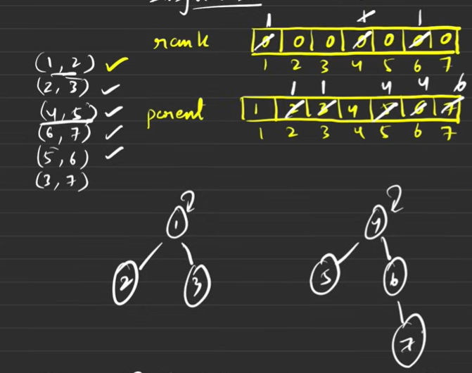

# DISJOINT Data Structure
## Introduction: 
#### A Disjoint Set (also called Union-Find) is a data structure that keeps track of a partition of a set into disjoint (non-overlapping) subsets. It supports two main operations:

1. Find: Determine which subset a particular element belongs to
2. Union: Merge two subsets into a single subset

## Core Operations
### 1. MakeSet(x): Creates a new set with element x

### 2. Find(x): Returns the representative (root) of the set containing x
To find whether they belong to each other or not, we should not see the parent, rather see the ultimate parent. If they are same then they belong to each other.
A NEW DATA STRUCTURE, NOT GRAPH.
### 3. Union(x, y): Merges the sets containing x and y
Union is implemented using the Rank and Size
Algorithm for Union: Ex: Union(x,y)
1. Find the ultimate parent of u,v i.e., pu and pv
2. Find the rank of pu and pv
3. Connect smaller rank to the larger rank

#### The disjoint DS is used when the graph is constantly changing, and works in constant time

#### The rank cannot be decreased using the path compression, hence it is called as the rank and not height.

## Path Compression:
1 -> 2 -> 3 -> 4 -> 5 will become 1 branching to 2,3,4,5 as the ultimate parent.
Algotithm: Uses Backtracking of parents to find the ultimate parent; Recursion of calling functions until parent is found
find parent(u):
if (u==parent(u))
return u;
else return find(parent(parent[u]))
