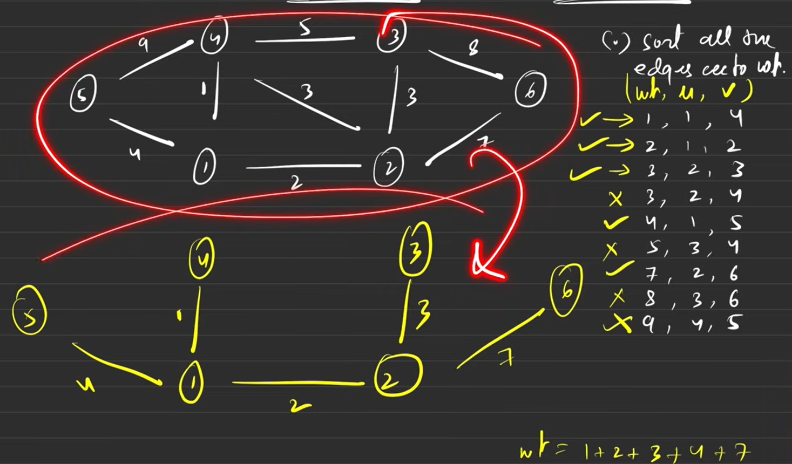

## MST: Minimum spanning tree:
### Spanning trees: In the given undirected graph, with 'n' nodes and 'm(n-1)' edges, and all nodes are reachable from each other.
Graphs can have any number of spanning trees;
MST:The ST with the minimum sum of all the edge weights""" 

## Algorithm:

1. Sort all the edges according to weight(wt, x, y); x, y are the nodes
2. Use disjoint DS to find the MST
